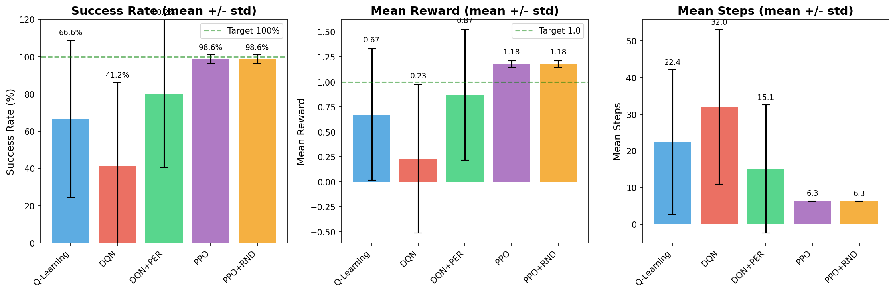
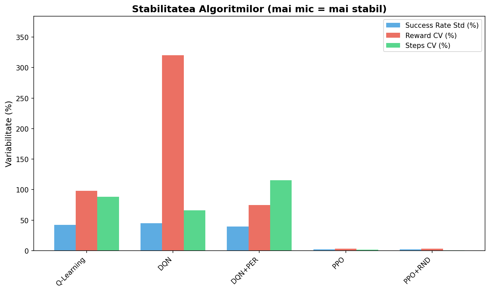
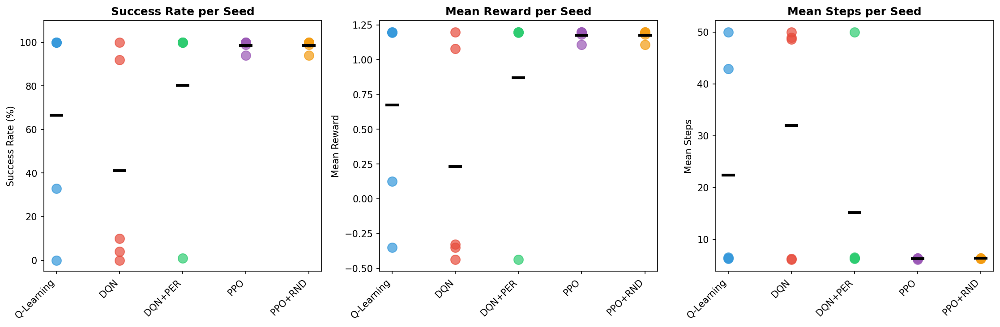

# Experimente Multi-Seed: Analiza Reproducibilitatii

## Ce este un Seed?

**Seed-ul** (samanta) este un numar care initializeaza generatorul de numere aleatoare. Folosind acelasi seed, obtii aceleasi numere "aleatoare" de fiecare data - acest lucru permite **reproducibilitatea** experimentelor.

In Reinforcement Learning, aleatoriul apare in multe locuri:

| Componenta | Rol aleatoriu |
|------------|---------------|
| **Generarea hartii** | Pozitia gaurilor in FrozenLake |
| **Initializarea retelelor** | Weights random la inceput (DQN, PPO) |
| **Explorare epsilon-greedy** | Ce actiuni aleatoare alege agentul |
| **Environment slippery** | Cand agentul aluneca in alta directie |
| **Replay buffer sampling** | Ce experiente sunt selectate pentru training |
| **Batch shuffling** | Ordinea datelor in mini-batch-uri |

---

## De ce avem nevoie de Multiple Seed-uri?

### Problema experimentului cu un singur seed

Daca rulezi experimentul **o singura data** cu seed=42:
- Poate ai noroc si harta e usoara → 100% success
- Sau ghinion si harta e grea → 0% success

**Nu stii daca algoritmul e bun sau ai avut doar noroc/ghinion!**

### Solutia: Experimente cu seed-uri multiple

Rulam acelasi experiment de **N ori** cu seed-uri diferite si calculam:
- **Media (mean)**: performanta medie a algoritmului
- **Deviatia standard (std)**: cat de mult variaza rezultatele

```
Rezultat final = mean ± std
```

Un algoritm bun are:
- **Media mare** (performanta buna)
- **Deviatie standard mica** (rezultate consistente)

---

## Configuratia Experimentelor

### Seed-uri folosite
```python
SEEDS = [42, 123, 456, 789, 1024]
```

### Environment
- **Tip**: EasyFrozenLake 4x4
- **Slippery**: 0.05 (5% sansa de alunecare)
- **Hole ratio**: 10%
- **Max steps**: 50

### Algoritmi testati
1. **Q-Learning** - metoda tabulara clasica
2. **DQN** - Deep Q-Network
3. **DQN+PER** - DQN cu Prioritized Experience Replay
4. **PPO** - Proximal Policy Optimization
5. **PPO+RND** - PPO cu Random Network Distillation

### Training
- Q-Learning, DQN, DQN+PER: **500 episoade**
- PPO, PPO+RND: **25,000 timesteps**

### Evaluare
- **100 episoade** per algoritm per seed
- Total: 5 algoritmi × 5 seeds × 100 episoade = **2,500 evaluari**

---

## Rezultate Complete

### Tabel Sumar

| Algorithm | Success Rate | Mean Reward | Mean Steps |
|-----------|--------------|-------------|------------|
| Q-Learning | 66.60% ± 42.22% | 0.67 ± 0.66 | 22.41 ± 19.75 |
| DQN | 41.20% ± 44.93% | 0.23 ± 0.74 | 31.97 ± 21.07 |
| DQN+PER | 80.20% ± 39.60% | 0.87 ± 0.65 | 15.13 ± 17.44 |
| **PPO** | **98.60% ± 2.33%** | **1.18 ± 0.04** | **6.30 ± 0.09** |
| **PPO+RND** | **98.60% ± 2.33%** | **1.18 ± 0.04** | **6.33 ± 0.04** |

### Rezultate Detaliate per Seed

#### Q-Learning
| Seed | Success Rate | Mean Reward | Mean Steps |
|------|--------------|-------------|------------|
| 42 | 100.00% | 1.1946 | 6.54 |
| 123 | 100.00% | 1.1967 | 6.33 |
| 456 | 100.00% | 1.1970 | 6.30 |
| 789 | 33.00% | 0.1246 | 42.87 |
| 1024 | 0.00% | -0.3510 | 50.00 |

#### DQN
| Seed | Success Rate | Mean Reward | Mean Steps |
|------|--------------|-------------|------------|
| 42 | 4.00% | -0.4382 | 48.91 |
| 123 | 100.00% | 1.1972 | 6.28 |
| 456 | 10.00% | -0.3288 | 48.58 |
| 789 | 0.00% | -0.3510 | 50.00 |
| 1024 | 92.00% | 1.0783 | 6.07 |

#### DQN+PER
| Seed | Success Rate | Mean Reward | Mean Steps |
|------|--------------|-------------|------------|
| 42 | 100.00% | 1.1963 | 6.37 |
| 123 | 100.00% | 1.1968 | 6.32 |
| 456 | 100.00% | 1.1961 | 6.39 |
| 789 | 100.00% | 1.1945 | 6.55 |
| 1024 | 1.00% | -0.4354 | 50.00 |

#### PPO
| Seed | Success Rate | Mean Reward | Mean Steps |
|------|--------------|-------------|------------|
| 42 | 100.00% | 1.1960 | 6.40 |
| 123 | 100.00% | 1.1963 | 6.37 |
| 456 | 100.00% | 1.1986 | 6.14 |
| 789 | 94.00% | 1.1066 | 6.34 |
| 1024 | 99.00% | 1.1824 | 6.26 |

#### PPO+RND
| Seed | Success Rate | Mean Reward | Mean Steps |
|------|--------------|-------------|------------|
| 42 | 100.00% | 1.1960 | 6.40 |
| 123 | 100.00% | 1.1971 | 6.29 |
| 456 | 100.00% | 1.1967 | 6.33 |
| 789 | 94.00% | 1.1066 | 6.34 |
| 1024 | 99.00% | 1.1823 | 6.27 |

---

## Analiza Rezultatelor

### 1. Stabilitate (Deviatie Standard)

**Clasificare dupa stabilitate:**

| Rang | Algorithm | Std Success Rate | Interpretare |
|------|-----------|------------------|--------------|
| 1 | PPO | 2.33% | Foarte stabil |
| 2 | PPO+RND | 2.33% | Foarte stabil |
| 3 | DQN+PER | 39.60% | Instabil |
| 4 | Q-Learning | 42.22% | Instabil |
| 5 | DQN | 44.93% | Foarte instabil |

**Observatie**: PPO si PPO+RND sunt singurii algoritmi cu deviatie standard sub 5%.

### 2. Performanta Medie

**Clasificare dupa success rate mediu:**

| Rang | Algorithm | Mean Success Rate |
|------|-----------|-------------------|
| 1 | PPO | 98.60% |
| 1 | PPO+RND | 98.60% |
| 3 | DQN+PER | 80.20% |
| 4 | Q-Learning | 66.60% |
| 5 | DQN | 41.20% |

### 3. Analiza Esecurilor

**Seed-uri problematice:**

- **Seed 789**: Q-Learning scade la 33%, dar PPO ramane la 94%
- **Seed 1024**: Q-Learning 0%, DQN+PER 1%, dar PPO 99%

**Concluzie**: Seed-urile 789 si 1024 genereaza harti mai dificile, unde doar PPO reuseste consistent.

### 4. Impact PER (Prioritized Experience Replay)

Comparatie DQN vs DQN+PER:

| Metrica | DQN | DQN+PER | Imbunatatire |
|---------|-----|---------|--------------|
| Mean Success | 41.20% | 80.20% | +39.00% |
| Std Success | 44.93% | 39.60% | -5.33% |

**Concluzie**: PER imbunatateste atat performanta cat si stabilitatea.

### 5. Impact RND (Random Network Distillation)

Comparatie PPO vs PPO+RND:

| Metrica | PPO | PPO+RND | Diferenta |
|---------|-----|---------|-----------|
| Mean Success | 98.60% | 98.60% | 0% |
| Mean Steps | 6.30 | 6.33 | +0.03 |

**Concluzie**: RND nu aduce beneficii pe acest environment simplu (rewards nu sunt sparse).

---

## Grafice Generate

### 1. Comparatie cu Error Bars


Grafic cu barele de eroare (mean ± std) pentru cele 3 metrici principale.

### 2. Stabilitatea Algoritmilor


Compara variabilitatea (deviatie standard) intre algoritmi.

### 3. Distributia per Seed


Arata rezultatele individuale pentru fiecare seed (puncte) si media (linie neagra).

---

## Concluzii

### Algoritmi Recomandati

1. **PPO** - Cel mai bun raport performanta/stabilitate
   - Success rate inalt (98.6%)
   - Deviatie standard foarte mica (2.3%)
   - Functioneaza bine pe toate seed-urile

2. **PPO+RND** - La fel de bun ca PPO pe acest environment
   - RND util pentru sparse rewards (nu e cazul aici)

3. **DQN+PER** - Bun, dar instabil
   - Performanta medie decenta (80.2%)
   - Poate esua complet pe anumite seed-uri

### Lectii Invatate

1. **Un singur seed nu e suficient** - Q-Learning pare perfect pe seed 42, dar esueaza pe 1024
2. **Policy-based > Value-based pentru stabilitate** - PPO e mai robust decat DQN
3. **PER ajuta DQN semnificativ** - De la 41% la 80% mean success
4. **RND e redundant pe task-uri simple** - Util doar pentru sparse rewards

---

## Cum sa Reproduci Experimentele

### Rulare benchmark multi-seed
```bash
cd proiect_irl
python experiments/benchmark_multi_seed.py
```

### Generare grafice
```bash
python experiments/visualize_multi_seed.py
```

### Modificare seed-uri
Editeaza `experiments/benchmark_multi_seed.py`:
```python
SEEDS = [42, 123, 456, 789, 1024]  # Modifica aici
```

---

## Referinte

- [Reproducibility in Deep Reinforcement Learning](https://arxiv.org/abs/1709.06560) - Henderson et al., 2018
- [Deep Reinforcement Learning that Matters](https://arxiv.org/abs/1709.06560) - Importanta seed-urilor in RL
- [Statistical Significance in RL](https://arxiv.org/abs/2108.13264) - Cum sa evaluezi corect algoritmii RL
