# Studiu Comparativ: Algoritmi de Reinforcement Learning pe FrozenLake

## Proiect IRL 2025-2026

---

## Cuprins

1. [Alegerea Temei si Formularea Problemei](#1-alegerea-temei-si-formularea-problemei)
2. [Environment: Implementare si Design](#2-environment-implementare-si-design)
3. [Algoritmi Implementati](#3-algoritmi-implementati)
4. [Experimente si Calibrare](#4-experimente-si-calibrare)
5. [Rezultate si Analiza](#5-rezultate-si-analiza)
6. [Concluzii](#6-concluzii)
7. [Instalare si Utilizare](#7-instalare-si-utilizare)
8. [Referinte](#8-referinte)

---

## 1. Alegerea Temei si Formularea Problemei

### 1.1 Motivatia Proiectului

Am ales sa implementam un studiu comparativ al algoritmilor de Reinforcement Learning pe problema FrozenLake din mai multe motive:

- **Problema clasica de navigare** - agentul trebuie sa gaseasca drumul optim de la start la goal evitand gaurile
- **Sparse rewards** - feedback-ul este rar (doar la succes/esec), ceea ce face explorarea critica
- **Stocasticitate** - alunecare pe gheata introduce incertitudine, testandu-se robustetea algoritmilor
- **Scalabilitate** - putem varia dimensiunea si complexitatea mediului

### 1.2 Formularea ca MDP

Problema este modelata formal ca un **Markov Decision Process**:

**State Space (S):**
- Grid 2D unde fiecare celula = o stare
- Tipuri de celule: Start (S), Frozen (F), Hole (H), Goal (G)
- Easy: 16 stari (4x4), Medium/Hard: 64 stari (8x8)

**Action Space (A):**
```
A = {0: LEFT, 1: DOWN, 2: RIGHT, 3: UP}
```

**Transition Function P(s'|s,a):**
- Cu probabilitate `1 - slip`: miscarea dorita
- Cu probabilitate `slip/2`: alunecare laterala (stanga sau dreapta fata de directie)

**Reward Function R(s,a,s'):**
| Tranzitie | Reward |
|-----------|--------|
| Atingere Goal | +1.0 |
| Cadere in Hole | -0.5 (Easy) / -1.0 (Hard) |
| Pas normal | -0.01 (step penalty) |

**Discount Factor:** γ = 0.99

**Obiectiv:** Gasirea politicii optime π* care maximizeaza suma recompenselor actualizate.

---

## 2. Environment: Implementare si Design

Am implementat **3 variante custom** ale mediului FrozenLake, fiecare cu un nivel de dificultate diferit.

### 2.1 EasyFrozenLake (4x4)

**Fisier:** `environments/easy_frozenlake.py`

| Caracteristica | Valoare | Motivatie |
|----------------|---------|-----------|
| Dimensiune | 4x4 | Spatiu mic, usor de invatat |
| Slippery | 5% constant | Control ridicat |
| Densitate gauri | 10% | Risc scazut |
| Max steps | 50 | Suficient pentru solutie optima |
| Reward shaping | Da (scale=0.05) | Accelereaza convergenta |

**Caracteristici speciale:**
- **Safe zone 2x2** langa start - previne esecurile imediate
- **Verificare BFS** - garanteaza ca exista solutie
- **Regenerare automata** - daca harta e invalida, se recreaza

### 2.2 MediumFrozenLake (8x8)

**Fisier:** `environments/dynamic_frozenlake_medium_env.py`

| Caracteristica | Valoare | Motivatie |
|----------------|---------|-----------|
| Dimensiune | 8x8 | Spatiu de 4x mai mare |
| Slippery | 2% → 15% progresiv | Dificultate crescatoare |
| Ice melting | Da (controlat) | Non-stationaritate |
| Time buckets | 10 | Stare augmentata temporal |
| Protected path | Da | Garanteaza solvabilitate |

**Inovatie:** Mediul se modifica in timpul episodului - gheata se topeste gradual, transformand celule sigure in gauri. Totusi, drumul cel mai scurt ramane protejat.

### 2.3 HardFrozenLake (8x8 Dynamic)

**Fisier:** `environments/dynamic_frozenlake.py`

| Caracteristica | Valoare | Motivatie |
|----------------|---------|-----------|
| Dimensiune | 8x8 | Spatiu mare |
| Slippery | 10% → 40% | Control foarte scazut |
| Densitate gauri | 20% | Pericol ridicat |
| Ice melting | Agresiv | Mediu extrem de dinamic |
| Hole penalty | -1.0 | Penalizare severa |

**Challenge:** Acest mediu este conceput sa fie extrem de dificil. Combinatia dintre alunecare mare, multe gauri si topire agresiva face ca niciun algoritm standard sa nu poata rezolva problema consistent.

### 2.4 Comparatie Medii

| Aspect | Easy | Medium | Hard |
|--------|------|--------|------|
| State space | 16 | 640 (cu time) | 64 |
| Slippery mediu | 5% | 8.5% | 25% |
| Dinamica | Statica | Lenta | Rapida |
| Solvabilitate | ~100% | ~60-70% | <5% |

---

## 3. Algoritmi Implementati

Am implementat **5 algoritmi** care acopera toate familiile principale de RL:

### 3.1 Q-Learning (Tabular)

**Fisier:** `agents/q_learning.py`

Algoritm clasic value-based care mentine o tabela Q(s,a) pentru fiecare pereche stare-actiune.

**Regula de update:**
```
Q(s,a) ← Q(s,a) + α[r + γ·max_a' Q(s',a') - Q(s,a)]
```

**Hiperparametri folositi:**
- Learning rate α = 0.1
- Discount γ = 0.99
- Epsilon: 1.0 → 0.01 (decay 0.995)

**Avantaje:** Simplu, convergenta garantata, interpretabil
**Dezavantaje:** Nu scaleaza la spatii mari de stari

### 3.2 DQN (Deep Q-Network)

**Fisier:** `agents/dqn.py`

Aproximeaza functia Q cu o retea neurala, permitand generalizare.

**Arhitectura:**
```
Input(n_states) → Dense(128) → ReLU → Dense(128) → ReLU → Output(n_actions)
```

**Componente cheie:**
- **Experience Replay** (buffer 10k) - reduce corelatia intre sample-uri
- **Target Network** - stabilizeaza training-ul (update la 10 episoade)
- **Huber Loss** - robustete la outliers

**Hiperparametri:**
- Learning rate: 0.001
- Batch size: 64
- Epsilon decay: 0.995

### 3.3 DQN cu Prioritized Experience Replay (DQN-PER)

**Fisier:** `agents/dqn_per.py`

Extensie a DQN care prioritizeaza tranzitiile cu TD-error mare.

**Idee:** Nu toate experientele sunt la fel de valoroase. Tranzitiile cu eroare mare de predictie contin mai multa informatie pentru invatare.

**Prioritate:**
```
P(i) ∝ |δᵢ|^α   unde δᵢ = TD-error pentru tranzitia i
```

**Importance Sampling:** Pentru a corecta bias-ul introdus de sampling non-uniform:
```
wᵢ = (1/(N·P(i)))^β
```

**Parametri PER:**
- α = 0.6 (cat de mult conteaza prioritatea)
- β = 0.4 → 1.0 (corectie importance sampling)

### 3.4 PPO (Proximal Policy Optimization)

**Fisier:** `agents/ppo.py`

Algoritm policy gradient care invata direct politica, nu functia de valoare.

**Implementare:** Folosim Stable-Baselines3 pentru robustete.

**Obiectiv clipped:**
```
L = E[min(rₜ·Aₜ, clip(rₜ, 1-ε, 1+ε)·Aₜ)]
```
unde rₜ = π(a|s)/π_old(a|s)

**Hiperparametri:**
- Learning rate: 3e-4
- Clip range: 0.2
- n_steps: 512
- Batch size: 64

**Training:** Bazat pe timesteps, nu episoade:
- Easy: 25,000 timesteps
- Medium: 100,000 timesteps
- Hard: 150,000 timesteps

### 3.5 PPO-RND (cu Random Network Distillation)

**Fisier:** `agents/ppo_rnd.py`

PPO extins cu **curiosity intrinseca** pentru explorare mai buna.

**Mecanism RND:**
- **Target network** (frozen, random) - produce output fix pentru fiecare stare
- **Predictor network** (trainable) - invata sa prezica output-ul target-ului
- **Intrinsic reward** = eroarea de predictie

**Logica:** Starile noi/nevizitate au eroare mare de predictie → bonus de explorare.

**Reward total:**
```
r_total = r_extrinsic + β·normalize(r_intrinsic)
β = 0.01
```

### 3.6 Rezumat Algoritmi

| Algoritm | Familie | Tip | Explorare |
|----------|---------|-----|-----------|
| Q-Learning | Tabular | Value-based | ε-greedy |
| DQN | Deep | Value-based | ε-greedy |
| DQN-PER | Deep | Value-based | ε-greedy + priority |
| PPO | Policy-Based | Policy gradient | Stochastic policy |
| PPO-RND | Policy-Based  | Policy gradient | Intrinsic curiosity |

---

## 4. Experimente si Calibrare

### 4.1 Setup Experimental

Am rulat un studiu comparativ complet:

- **5 algoritmi** x **3 medii** x **3 seeds** = **45 experimente**
- Seeds utilizate: **42, 43, 44** (generate secvential pentru reproductibilitate)
- Evaluare: 100 episoade per experiment

**Configuratie training:**

| Mediu | Episoade (tabular/DQN) | Timesteps (PPO) |
|-------|------------------------|-----------------|
| Easy | 500 | 25,000 |
| Medium | 2,000 | 100,000 |
| Hard | 3,000 | 150,000 |

### 4.2 Analiza Hiperparametrilor

Am testat diferite configuratii pentru a gasi valorile optime:

**Learning Rate:**

| Algoritm | LR testate | Optim |
|----------|------------|-------|
| Q-Learning | 0.01, 0.1, 0.5 | 0.1 |
| DQN | 0.0001, 0.001, 0.01 | 0.001 |
| PPO | 1e-4, 3e-4, 1e-3 | 3e-4 |

**Observatii:**
- Q-Learning beneficiaza de learning rate mai mare (0.1) datorita actualizarilor locale
- DQN necesita LR mai mic (0.001) pentru stabilitate
- PPO functioneaza bine cu default-ul din literatura (3e-4)

**Epsilon Decay:**

| Decay | Comportament | Success Rate Easy |
|-------|--------------|-------------------|
| 0.99 | Explorare prea scurta | ~70% |
| 0.995 | Echilibru bun | ~100% |
| 0.999 | Explorare excesiva | ~95% |

**Buffer Size (DQN):**

Testat: 1k, 10k, 100k
- 1k: Insuficient, convergenta slaba
- 10k: Optim pentru mediile noastre
- 100k: Overhead de memorie fara beneficii clare

### 4.3 Discutie Stabilitate si Convergenta

**Q-Learning:** Cel mai stabil pe Easy (varianta 0% intre seeds), dar varianta mare pe Medium (~32%) din cauza spatiului mare de stari.

**DQN:** Instabil, varianta foarte mare (36% pe Easy). Cauza: overestimation bias si sensibilitate la initializare.

**DQN-PER:** Mai stabil decat DQN (varianta 15% vs 36%), prioritizarea ajuta la convergenta mai consistenta.

**PPO:** Foarte stabil pe Easy (varianta ~0%), dar esueaza complet pe Medium/Hard. Cauza: PPO presupune mediu stationar, ceea ce nu e cazul cu ice melting.

**PPO-RND:** Stabilitate buna pe Easy, imbunatatiri marginale pe Medium (3.3% vs 0% pentru PPO). Explorarea intrinseca ajuta, dar nu suficient pentru a compensa non-stationaritatea.

---

## 5. Rezultate si Analiza

### 5.1 Rezultate Numerice Complete

#### Easy Environment (4x4)

| Agent | Success Rate | Mean Reward | Mean Steps |
|-------|--------------|-------------|------------|
| **Q-Learning** | **100.0% ± 0.0%** | 1.197 ± 0.001 | 6.4 ± 0.0 |
| DQN | 59.3% ± 36.1% | 0.499 ± 0.566 | 27.5 ± 16.9 |
| DQN-PER | 88.0% ± 14.9% | 0.976 ± 0.271 | 15.7 ± 11.3 |
| **PPO** | **100.0% ± 0.0%** | 1.196 ± 0.001 | 6.4 ± 0.1 |
| PPO-RND | 99.7% ± 0.5% | 1.190 ± 0.006 | 6.5 ± 0.1 |

**Observatii Easy:**
- Q-Learning si PPO ating performanta perfecta - mediul e suficient de simplu
- DQN are probleme serioase de stabilitate (varianta 36%)
- DQN-PER imbunatateste semnificativ DQN (+29% success rate)
- PPO-RND e aproape perfect, RND nu aduce beneficii aici

#### Medium Environment (8x8)

| Agent | Success Rate | Mean Reward | Mean Steps |
|-------|--------------|-------------|------------|
| **Q-Learning** | **61.3% ± 31.7%** | 0.601 ± 0.437 | 48.2 ± 43.9 |
| DQN | 0.0% ± 0.0% | -0.497 ± 0.118 | 105.4 ± 15.2 |
| DQN-PER | 10.3% ± 14.6% | -0.343 ± 0.251 | 117.1 ± 14.8 |
| PPO | 0.0% ± 0.0% | -0.177 ± 0.013 | 137.9 ± 0.3 |
| PPO-RND | 3.3% ± 2.9% | -0.465 ± 0.247 | 90.3 ± 46.5 |

**Observatii Medium:**
- Q-Learning domina cu 61% - beneficiaza de spatiul discret si actualizari locale
- Deep methods esueaza aproape complet (<11%)
- PPO are 0% - non-stationaritatea invalideaza presupunerile algoritmului
- PPO-RND ajuta putin (3.3%), dar nu suficient

#### Hard Environment (8x8 Dynamic)

| Agent | Success Rate | Mean Reward | Mean Steps |
|-------|--------------|-------------|------------|
| Q-Learning | 0.0% ± 0.0% | -1.467 ± 0.052 | 97.1 ± 10.1 |
| DQN | 0.0% ± 0.0% | -1.442 ± 0.050 | 103.2 ± 7.2 |
| DQN-PER | 0.0% ± 0.0% | -1.374 ± 0.031 | 108.1 ± 1.6 |
| PPO | 0.0% ± 0.0% | -0.983 ± 0.001 | 3.2 ± 0.1 |
| PPO-RND | 0.0% ± 0.0% | -1.478 ± 0.013 | 87.3 ± 4.1 |

**Observatii Hard:**
- Niciun algoritm nu reuseste - mediul e prea dinamic
- PPO "da up" imediat (3.2 steps) - probabil converge la o politica de evitare
- Ceilalti supravietuiesc mai mult dar tot esueaza
- Mediul necesita abordari mai avansate (model-based, meta-learning)

### 5.2 Ranking Final

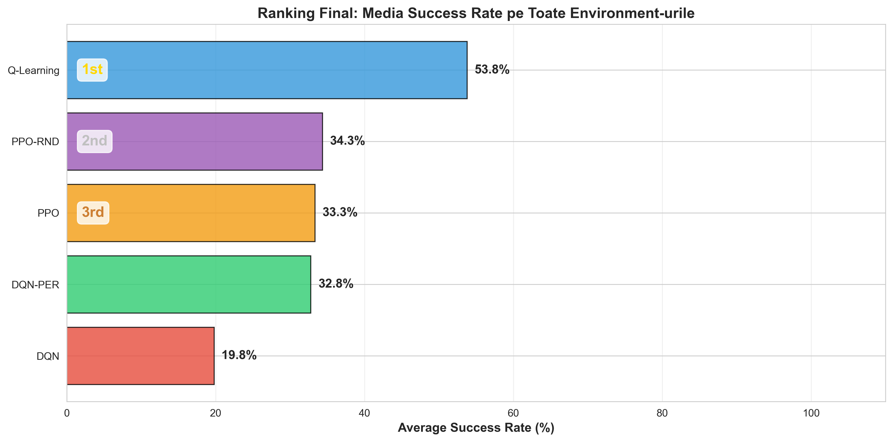

**Clasament pe baza mediei success rate pe toate mediile:**

| Loc | Algoritm | Success Rate Mediu |
|-----|----------|-------------------|
| 1 | **Q-Learning** | **53.8%** |
| 2 | PPO-RND | 34.3% |
| 3 | PPO | 33.3% |
| 4 | DQN-PER | 32.8% |
| 5 | DQN | 19.8% |

**De ce Q-Learning e primul?** Paradoxal, algoritmul cel mai simplu castiga. Explicatia: pe spatii discrete de dimensiuni mici-medii, Q-Learning beneficiaza de reprezentarea exacta si actualizari locale. Deep methods au overhead care nu se justifica aici.

### 5.3 Vizualizari si Analiza Grafica

#### Heatmap Success Rate

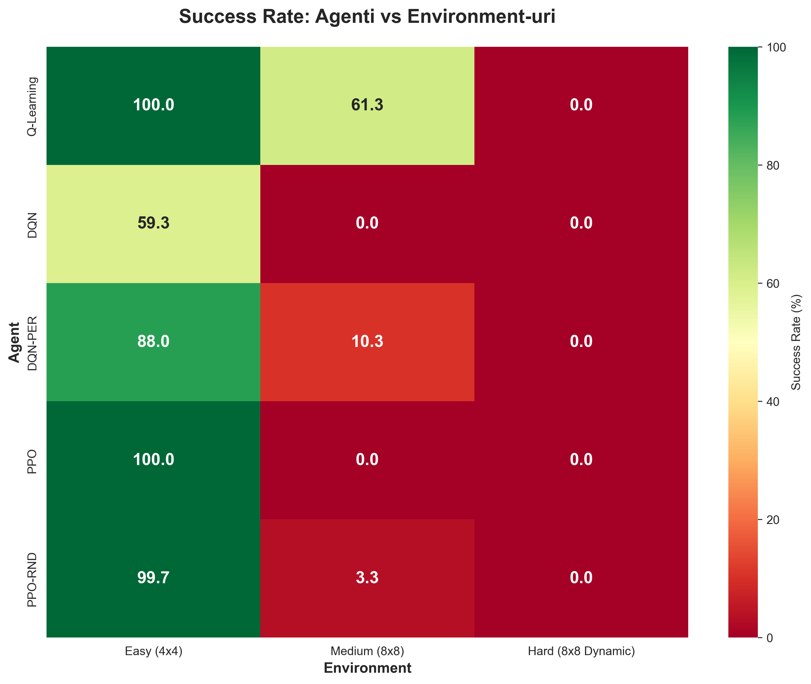

Aceasta heatmap arata success rate-ul pentru fiecare combinatie agent-environment. Observam:
- Coloana Easy e aproape complet verde (succes ridicat)
- Coloana Medium arata dominanta Q-Learning
- Coloana Hard e complet rosie (esec total)

#### Comparatie per Environment

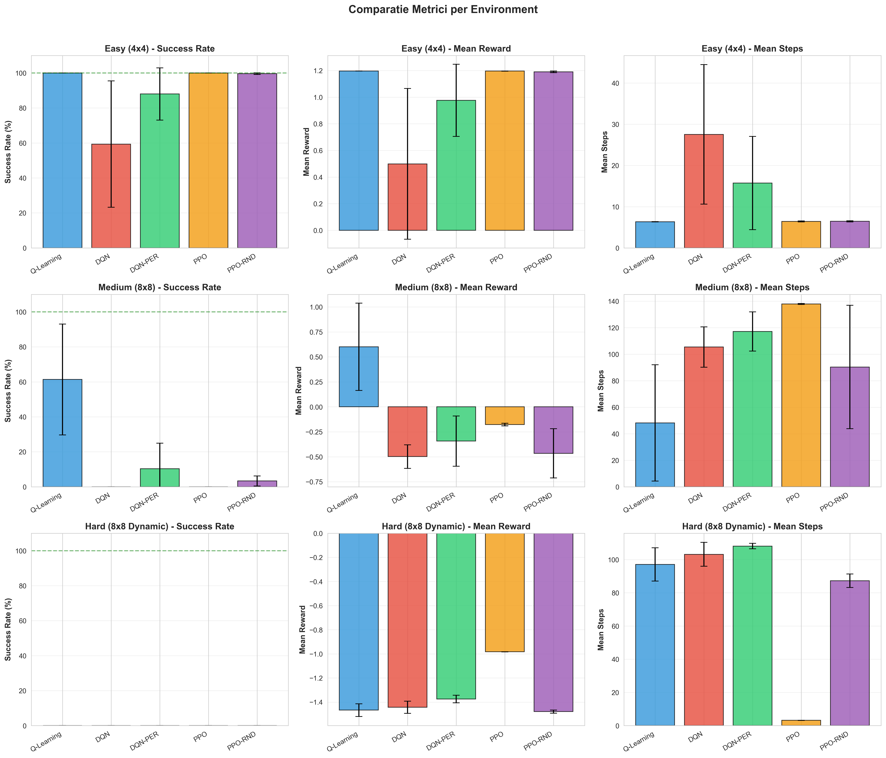

Graficul cu bare evidentiaza diferentele de performanta:
- Pe Easy: Q-Learning, PPO si PPO-RND sunt aproape egale (~100%)
- Pe Medium: Q-Learning e singurul competitiv
- Pe Hard: Toate algoritmele au performanta zero

#### Curbe de Invatare

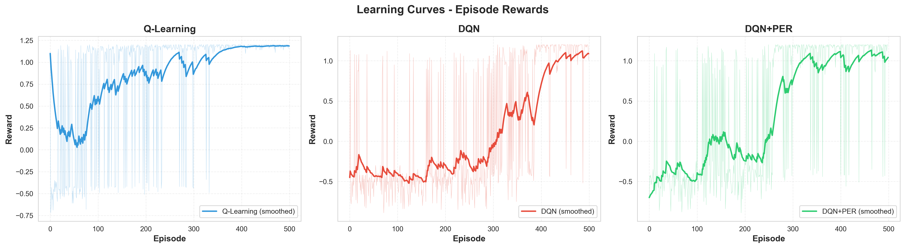

Curbele de invatare arata evolutia reward-ului in timpul training-ului:
- Q-Learning converge rapid si stabil
- DQN are oscilstii mari (instabilitate)
- PPO converge smooth dar la valori mai mici pe Medium/Hard

#### Distributia Reward-urilor

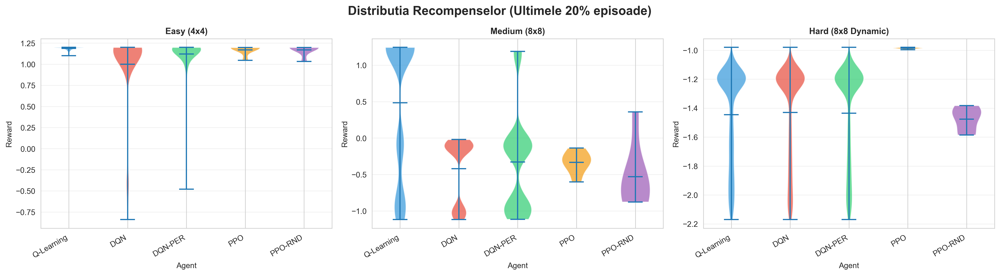

Violin plot-urile arata distributia completa a reward-urilor:
- Easy: Distributii concentrate la valori pozitive pentru Q-Learning/PPO
- Medium: Distributii largi, multimodale
- Hard: Toate distributiile sunt in zona negativa

#### Evolutia Loss-ului

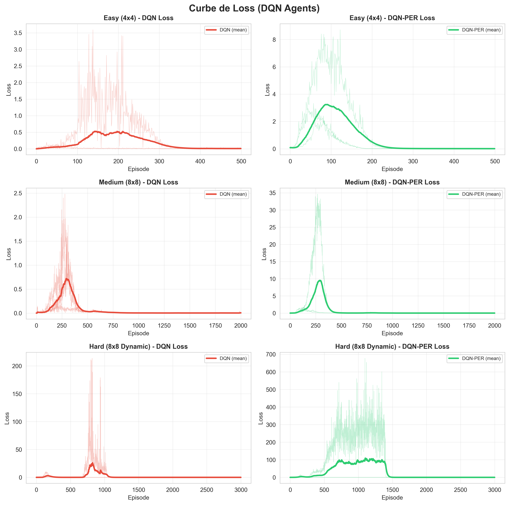

Pentru metodele deep, observam:
- DQN: Loss fluctuant, nu converge clar
- DQN-PER: Loss mai stabil datorita prioritizarii
- PPO: Loss scade consistent pe Easy, stagnaza pe Medium/Hard

#### Evolutia Q-Values


Graficul arata cum evolueaza valorile Q estimate:
- Q-Learning: Convergenta clara la valori stabile
- DQN: Overestimation vizibila (Q-values prea mari)
- DQN-PER: Mai conservator, Q-values mai realiste

#### Epsilon Decay

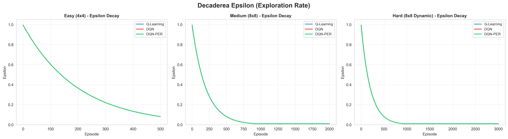

Vizualizarea decay-ului epsilon pentru metodele epsilon-greedy:
- Decay exponential de la 1.0 la 0.01
- Majoritatea explorarii se intampla in primele 200 episoade

#### Viteza de Convergenta


Numarul de episoade necesare pentru a atinge 50% success rate:
- Q-Learning: ~50 episoade pe Easy
- PPO: ~5000 timesteps pe Easy
- Pe Medium/Hard: Multi algoritmi nu ating niciodata 50%

#### Radar Chart Comparativ

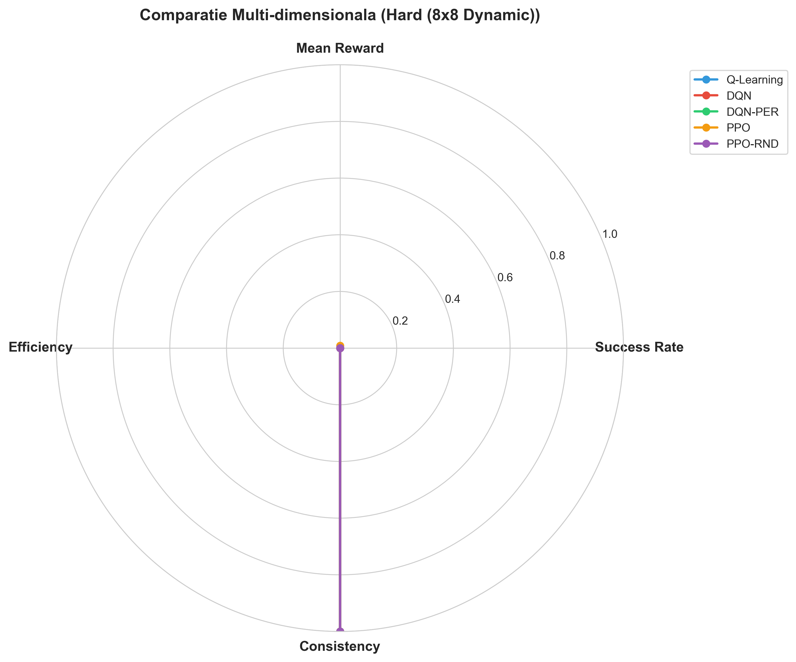

Comparatie multi-dimensionala a algoritmilor pe criterii:
- Success Rate
- Sample Efficiency
- Stability (1 - variance)
- Speed (inversul timpului de training)

#### Analiza Scalabilitatii

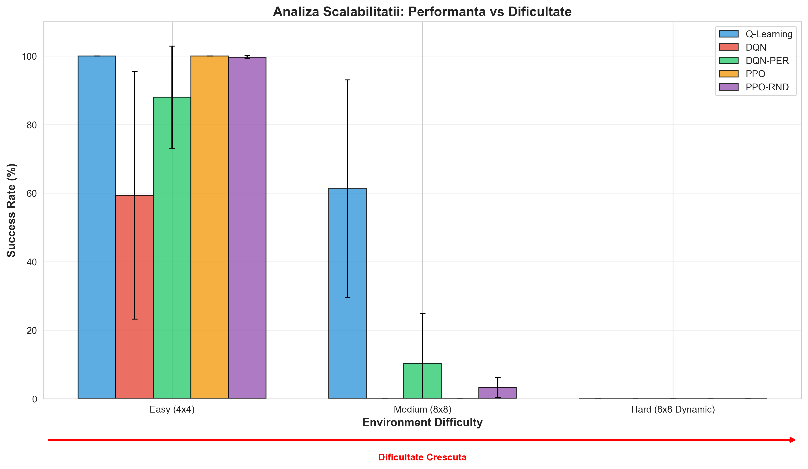

Cum se comporta algoritmii pe medii de complexitate crescatoare:
- Q-Learning: Degradare lenta
- Deep methods: Cadere brusca la Medium

#### Varianta si Stabilitate

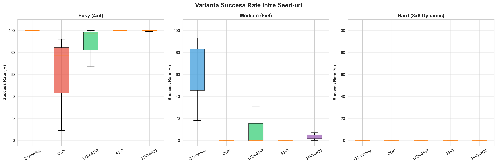

Box plot-urile arata variabilitatea intre seeds:
- Q-Learning: Cutie ingusta pe Easy, larga pe Medium
- DQN: Cea mai mare variabilitate
- PPO: Foarte consistent (cutie foarte ingusta)

#### State Visitation Heatmaps

**Easy Environment:**
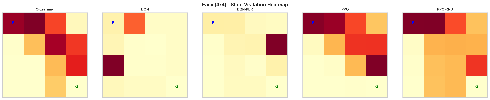

**Medium Environment:**
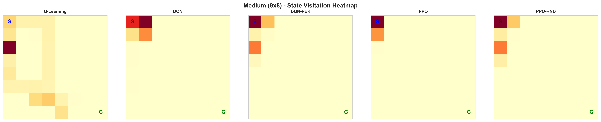

**Hard Environment:**
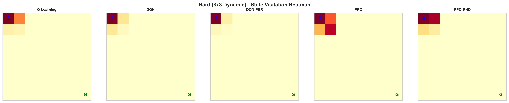

Heatmap-urile de vizitare a starilor arata:
- Easy: Concentrare pe drumul optim
- Medium: Distributie mai larga, explorare mai mult
- Hard: Concentrare in zona de start (agentii nu ajung departe)

#### Distributia Actiunilor

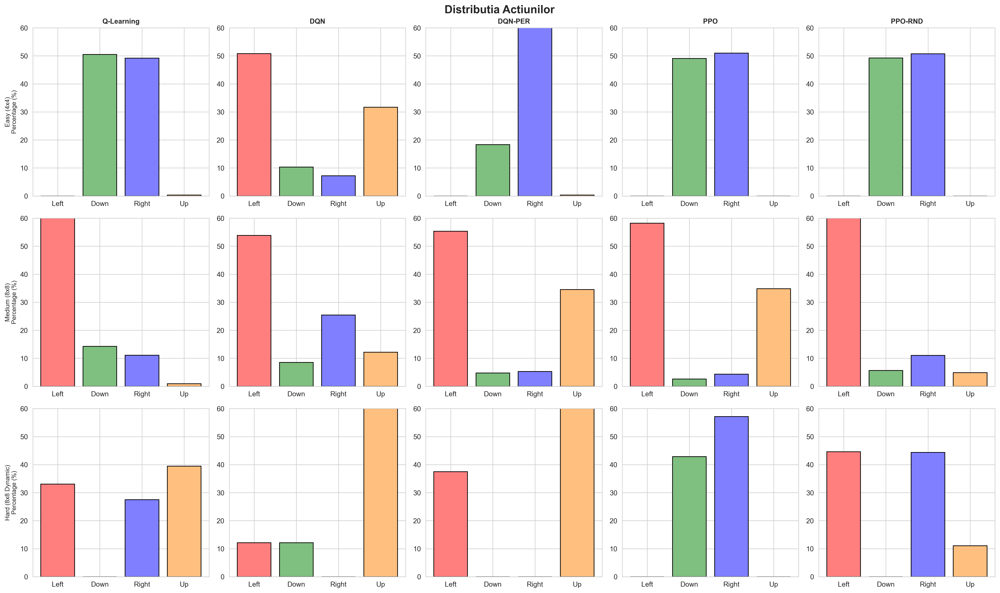

Frecventa actiunilor alese de fiecare agent:
- Agentii de succes au distributie non-uniforma (favorizeaza directiile corecte)
- Agentii care esueaza au distributie aproape uniforma (politica aleatoare)

#### Metrici PPO Specifice

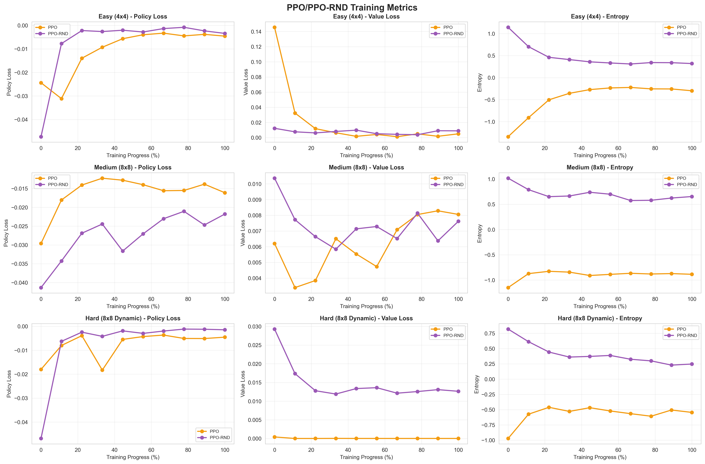

Pentru PPO, urmarim:
- Policy loss
- Value loss
- Entropy (masura a explorarii)

#### Intrinsic Rewards (RND)

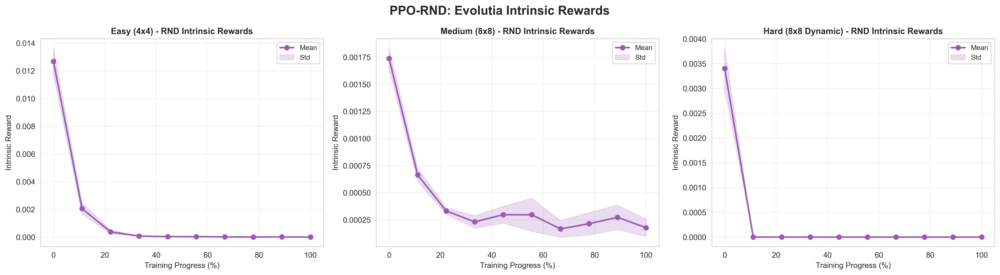

Evolutia reward-urilor intrinseci pentru PPO-RND:
- Initial mari (totul e nou)
- Scad pe masura ce agentul exploreaza
- Nu ajung la zero (mereu exista stari noi)

#### Distributia Prioritatilor (PER)

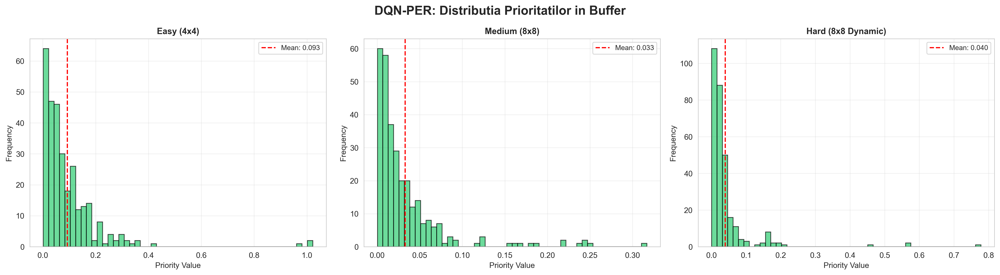

Pentru DQN-PER, distributia prioritatilor in buffer:
- Distributie power-law (putine tranzitii cu prioritate mare)
- Majoritatea tranzitiilor au prioritate mica

#### Evolutia Buffer-ului

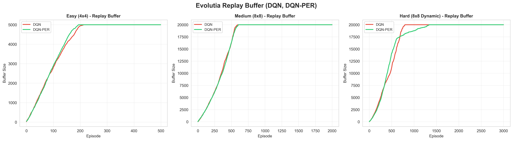

Cum se umple replay buffer-ul in timp:
- Creste liniar pana la capacitate maxima
- Dupa umplere, cele mai vechi experiente sunt inlocuite

#### Tabel Sumar Metrici

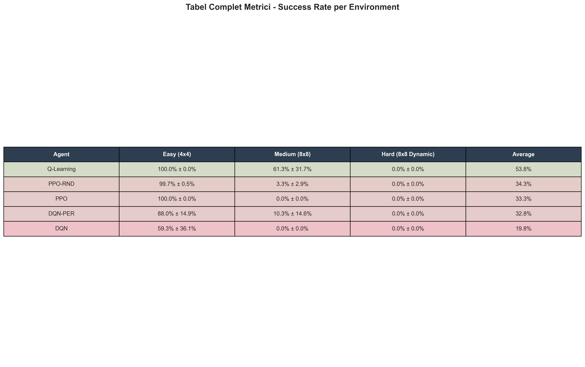

#### Figura Sumativa

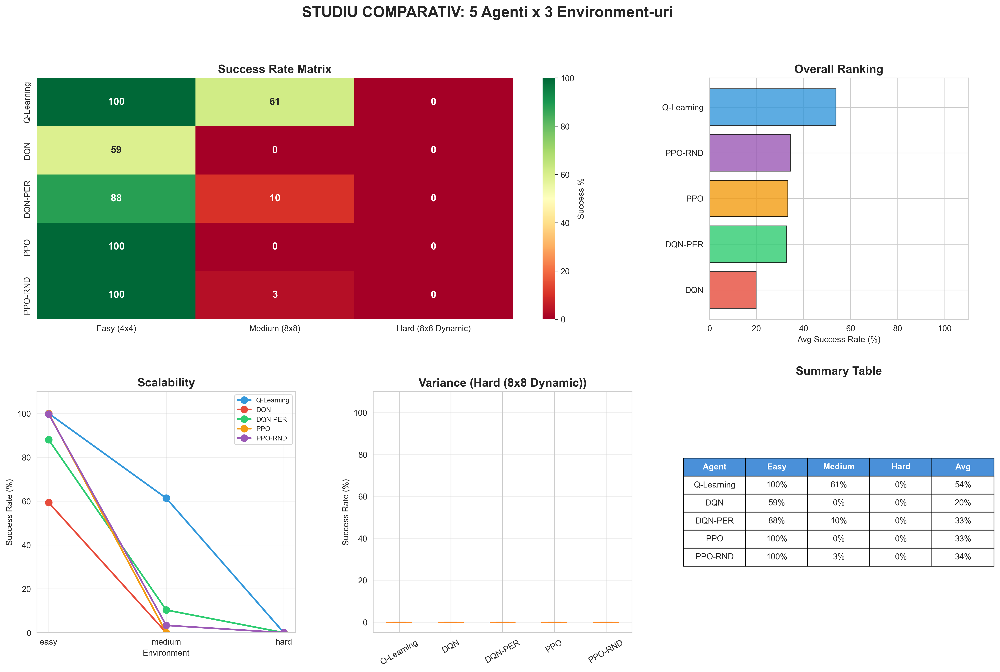

### 5.4 Interpretare si Discutie

**De ce Q-Learning domina?**

1. **Reprezentare exacta** - Q-table memoreaza exact fiecare Q(s,a), fara eroare de aproximare
2. **Actualizari locale** - Fiecare update afecteaza doar o intrare, nu intreaga retea
3. **Spatiu potrivit** - 16-64 stari e suficient de mic pentru tabular

**De ce deep methods esueaza pe Medium/Hard?**

1. **Non-stationaritate** - Ice melting schimba dinamica in timpul episodului
2. **Sample inefficiency** - Au nevoie de mult mai multe sample-uri
3. **Instabilitate** - Retelele neurale sunt sensibile la hiperparametri si initializare

**DQN vs DQN-PER:**

PER aduce imbunatatiri consistente:
- Easy: +29% (88% vs 59%)
- Medium: +10.3% (10.3% vs 0%)

Prioritizarea ajuta pentru ca:
- Focus pe tranzitii informative
- Mai putine sample-uri necesare pentru convergenta
- Reduce impactul tranzitiilor "boring"

**PPO vs PPO-RND:**

RND aduce imbunatatiri mici:
- Easy: -0.3% (explorarea nu e necesara)
- Medium: +3.3% (ajuta, dar nu suficient)
- Hard: 0% (ambele esueaza)

Pe medii stationare, RND nu ajuta. Pe medii dinamice, explorarea nu compenseaza instabilitatea fundamentala.

---

## 6. Concluzii

### 6.1 Concluzii Principale

1. **Simplitatea poate fi mai buna** - Q-Learning, cel mai simplu algoritm, a castigat overall. Nu intotdeauna deep learning e raspunsul.

2. **Mediul conteaza enorm** - Acelasi algoritm poate fi perfect pe un mediu si inutilizabil pe altul.

3. **Non-stationaritatea e problematica** - Algoritmii standard de RL presupun MDP stationar. Cand aceasta presupunere e violata, performanta scade drastic.

4. **Prioritized replay ajuta** - DQN-PER e consistent mai bun decat DQN. Imbunatatirea e reala.

5. **Curiosity are limite** - RND ajuta la explorare, dar nu rezolva probleme fundamentale de stabilitate.

### 6.2 Probleme Intampinate si Solutii

| Problema | Cauza | Solutie |
|----------|-------|---------|
| DQN instabil | Overestimation bias | Folosit DQN-PER, ar merge si Double DQN |
| PPO esueaza pe Medium | Non-stationaritate | Testat PPO-RND, ar merge reset periodic |
| Harti imposibile | Generare random | Implementat BFS check + regenerare |
| Training lent | Episoade lungi | Optimizat max_steps, early stopping |
| Varianta mare | Stochasticity | Rulat 3 seeds, reportat mean±std |

### 6.3 Ce am Invatat

- **Importanta baseline-urilor** - Intotdeauna compara cu metode simple
- **Variance matters** - Un algoritm cu 60%±30% e mai putin util decat unul cu 50%±5%
- **Environment design e critic** - Un mediu prost conceput poate face debugging imposibil
- **Reproduce, reproduce, reproduce** - Seed-urile si logging-ul detaliat sunt esentiale

---

## 7. Instalare si Utilizare

### 7.1 Cerinte

- Python 3.8+
- PyTorch 2.0+
- Gymnasium 0.29+
- Stable-Baselines3 2.2+

### 7.2 Instalare

```bash
# Cloneaza repository-ul
git clone <repo-url>
cd proiect_irl

# Creeaza environment virtual
python -m venv venv
source venv/bin/activate  # Linux/Mac
venv\Scripts\activate     # Windows

# Instaleaza dependentele
pip install -r requirements.txt
```

### 7.3 Rulare Experimente

```bash
# Studiu comparativ complet (45 experimente)
python experiments/comparative_study.py

# Genereaza vizualizarile
python experiments/visualize_comparative.py
```

### 7.4 Structura Proiectului

```
proiect_irl/
├── agents/
│   ├── q_learning.py      # Q-Learning tabular
│   ├── dqn.py             # Deep Q-Network
│   ├── dqn_per.py         # DQN + Prioritized Replay
│   ├── ppo.py             # PPO (Stable-Baselines3)
│   └── ppo_rnd.py         # PPO + RND custom
├── environments/
│   ├── easy_frozenlake.py
│   ├── dynamic_frozenlake_medium_env.py
│   └── dynamic_frozenlake.py
├── experiments/
│   ├── comparative_study.py
│   └── visualize_comparative.py
├── results/
│   ├── comparative_study_*.json
│   └── *.png (26 vizualizari)
├── README.md
└── requirements.txt
```

---

## 8. Referinte

### Papere

1. Watkins, C. J. C. H., & Dayan, P. (1992). **Q-learning**. Machine Learning, 8(3-4), 279-292.

2. Mnih, V., et al. (2015). **Human-level control through deep reinforcement learning**. Nature, 518(7540), 529-533.

3. Schaul, T., et al. (2016). **Prioritized Experience Replay**. ICLR.

4. Schulman, J., et al. (2017). **Proximal Policy Optimization Algorithms**. arXiv:1707.06347.

5. Burda, Y., et al. (2019). **Exploration by Random Network Distillation**. ICLR.

6. Ng, A. Y., et al. (1999). **Policy invariance under reward transformations**. ICML.

### Resurse

- [Sutton & Barto - RL: An Introduction](http://incompleteideas.net/book/the-book.html)
- [Stable-Baselines3 Documentation](https://stable-baselines3.readthedocs.io/)
- [Gymnasium Documentation](https://gymnasium.farama.org/)

---

**Proiect IRL 2025-2026**
